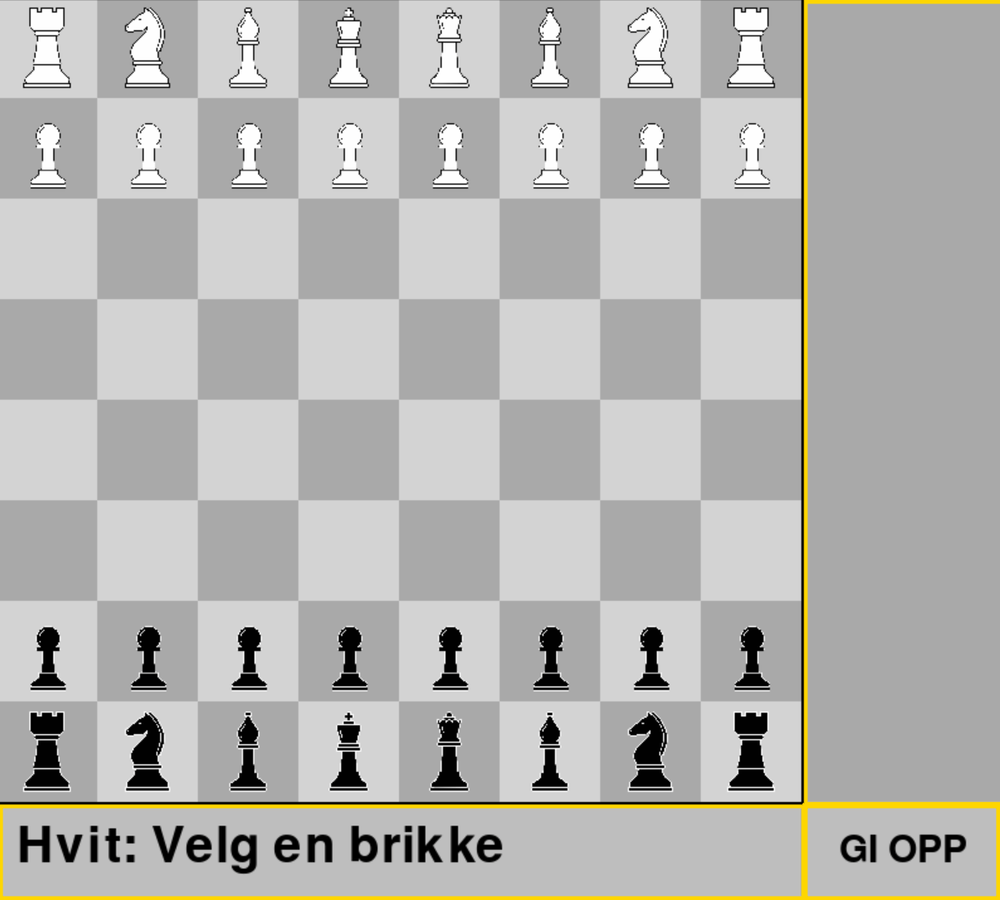

# Chess from kvante-PC ♟️

This is a simple chess game built with **Python and Pygame** as part of a school project.  
The goal was to create a fully playable 2-player chess game with basic move validation and a clean visual interface.

---



---

## Features

- Classic 8x8 chess board
- Click to select and move pieces
- Valid moves are highlighted
- Captured pieces are displayed on the side
- Turn-based system (white / black)
- Check indication (king flashes when in check)
- Simple win condition when a king is captured
- Restart option after game over

---

## About the Logic

All standard chess pieces are implemented:
- Pawn  
- Rook  
- Knight  
- Bishop  
- Queen  
- King  

The move generation logic for each piece is written manually.  
I did look up and reuse some ideas/algorithms online for the more complicated movement logic (especially for sliding pieces like rook, bishop, and queen). The rest was adapted and integrated into my own structure.

---

## How to Run

1. Install pygame:
   ```bash
   pip install pygame