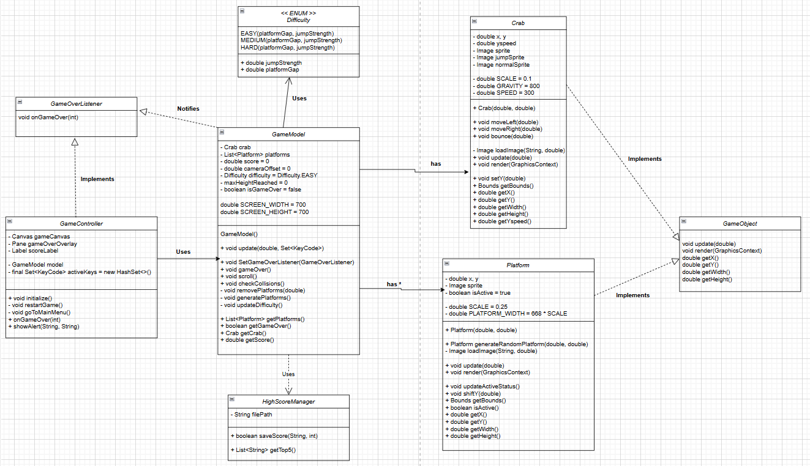

# Beskrivelse av appen
Jeg har utviklet et plattformspill kalt "CrabJumper" hvor spilleren styrer en krabbe som hopper fra plattform til plattform (fisk til fisk) for å nå overflaten. Krabben hopper automatisk oppover når den treffer en plattform overnfra, og spilleren kan styre krabbens bevegelse til venstre og høyre med tastene A/D eller pil venstre/høyre. Spillet benytter tyngdekraft og scrolling for å skape bevegelse, og nye plattformer genereres dynamisk mens eldre fjernes etter hvert som de forsvinner ut av skjermen. Spilleren samler poeng ved å hoppe til høyere høyder, og vanskelighetsgraden øker etter hvert. Når spilleren faller ut av skjermen, vises en game-obver-boks med score og mulighet for å starte på nytt eller gå til hovedmeny. Appen inkluderer også en highscore-liste over de 5 beste highscorene, og brukeren kan legge inn eget navn før de spiller i startskjermen.

# Diagram
Jeg har valgt å lage et klassediagram som viser de sentrale klassene i prosjektet og deres relasjoner. Diagrammet inkluderer klassene GameController, GameModel, Crab, Platform, HighScoreManager, Difficulty (enum), GameObject (interface) og gameOverListener (interface). Det illustrerer bruken av sammensatte objekter, enums og interface og viser hvordan GameMoedl fungerer som kjerne i spillet.

# Spørsmål
## Hvilke deler av pensum i emnet dekkes i prosjektet, og på hvilken måte?
Prosjektet dekker store deler av pensum:

Synlighetsmodifikatorer: Det benyttes private og public for å kontrollere tilgang til metoder og variabler. Private felter og metoder tilgjengeligggjøres ved gettere og settere

Modifikatorer som static og final: Kontantverdier som SCREEN_WIDTH og SCALE er static final. Static metoder brukes i HighScoreManager.

Wrapper-klasser: Det brukes Integer i Map.Entry<String, Integer> for highscore-håndtering.

Collections og Generics: Brukes List<Platform>, Set<KeyCode> osv... mange steder.

Funksjonelle grensesnitt og lambdauttrykk: Det brukes lambdauttrykk som Comparator i entries.sort((a,b) -> b.getValue() - a.getValue()); og i forEach(p -> ...) som bygger på Consumer<T>

Streams: I metoden generatePlatforms() bruker vi platforms.stream().mapToDouble(...).min().orElse(...) for å finne høyereste plattform. Skal være en effektiv bruk av Stream API.

Klasser og objekter: Hele applikasjonen er bygget rundt objektorienterte prinsipper med entydige roller for Crab, Platform, GameModel osv...

Interface: GameObject brukes som interface som definerer felles metoder for objekter som kan tegnes og oppdateres. Samtidig brukes også GameOverListener-interface for observatøren av subjektet GameModel

Observatør-Observert-teknikk: Programmet bruker et observermønster hvor GameModel varsler lyttere når en game-over situasjon oppstår. GameController implementerer GameOverListener og reagerer deretter med å vise sluttresultat og knapper for videre valg. Da blir altså GameModel subjektet som blir observert og GameController observatøren.

Delegering: Tastetrykk delegeres via GameController til GameModel. Tastetrykk i GameController fanges opp via SetOnKeyPressed og setOnKeyReleased, og sendes videre til GameModel via en Set<KeyCode>. Dette gir modellen kontroll over hvilke knapper som er aktive og hvordan de skal påvirke spillet.

Feilhåndtering: Jeg har lagt til feilhåndtering på passene steder i programmet som er litt ekstra utsatt, for eksempel i filbehandling og bildeinnlasting. Ved feil i bildeinnlasting vises et fallback-bilde laget med WritableImage. Vi håndterer IOEXception eksplisitt i filoperasjoner. Vi bruker både try-catch og throws-signaturer.

## Dersom deler av pensum ikke er fekket i prosjektet deres, hvordan kunne dere brukt disse delen av pensum i appen?
Jeg har ikke brukt arv noe særlig i appen. Jeg kunne brukt arv mellom Crab og platform, som begge implementerer GameOject, men de kunne arvet fra en felles GameEntity-superklasse. Som kanskje ville redusert duplisering og gjort koden mer gjenbrukbar.

Jeg har heller ikke brukt instanceof. Kunne vært brukt for å identifisere ulike typer plattformer i en polymorf struktur. Hvis jeg ville ha flere typer plattformer.

Jeg har ikke brukt modifikatoren abstract. GameObjevt er for eksempel er interface som kunne vært en abstrakt klasse ved behov.

## Hvordan forholder koden deres seg til Model-View-Controller-prinsippet?
Koden er strukturert med MVC-prinsipper:

Model: GameModel håndterer all spilllogikk, inkludert bevegelse, kollisjon, score, vanskelighetsgrad og spillstatus.

View: Selve visningen er i Game.fxml via SceneBuilder, og GameController oppdaterer skjermen ved hjelp av GraphicsContext

Controller: GameController håndterer input fra brukeren og videresender det til modellen. Den registrer seg også som lytter på game-over-hendelser og viser GameOverOverlay.

En svakhet er at GameController også tegner score på skjermen, som egentlig er View sitt ansvar. Dette kunne vært skilt bedre.

## Hvordan har dere gått frem når dere skulle teste appen deres, og hvorfor har dere valgt de testene dere har? Har dere testet alle deler av koden? Hvis ikke, hvordan har dere prioritert hvilke deler som testes og ikke?

Jeg har valgt å fokusere på testing av spilllogikk og feilhåndtering, ettersom dette utgjør kjernen i spillet. Testene er skrevet med JUnit 5 og dekker en rekke viktige scanerier:

Tyngdekraften i spillet testes ved å sjekke at krabbens yspeed øker etter en oppdatering.

Kollisjonstesting verifiserer at krabben spretter når den treffer en plattform ovenfra, noe som er en kritisk del av spillets mekanikk.

GameOver testes ved at krabben faller under skjermen, noe som sørger for at observatørmønsteret aktiveres korrekt.

Generering og fjerning av plattformer testes for å sikre at gamle plattformer forsvinner, og at nye generes i riktig høyde underveis i spillet.

En egen test for scoretelling beskrefter at spilleren får poeng etter å ha nådd høyere høyder, å tid med game designet.

Til slutt har vi en test for filbehandling, hvor vi bruker en midlertidig tekstfil for å sikre at highscore lagres og lese korrekt, uten å forstyrre den faktisk highscore-listen brukt i spillet.

