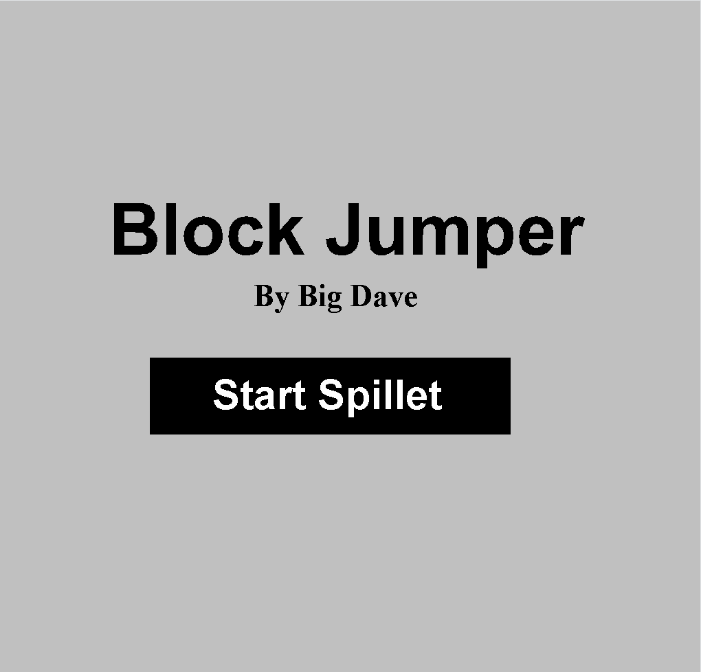

# PlatformGame

PlatformGame is a small 2D-plattformgame made in Java. It is built to practice on game loop, input-handling, collisions and level-design. 

The project is easy enough to read, but structured enough for it to feel like a "real" game-project, with separate classes for player, enemies, walls, maps and screens.

The goal is to have a clean and learning-friendly codeproject to experience the world of game-design!

