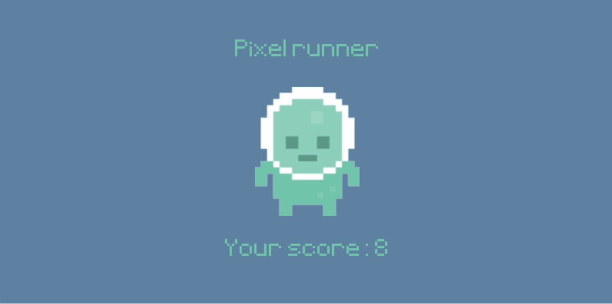
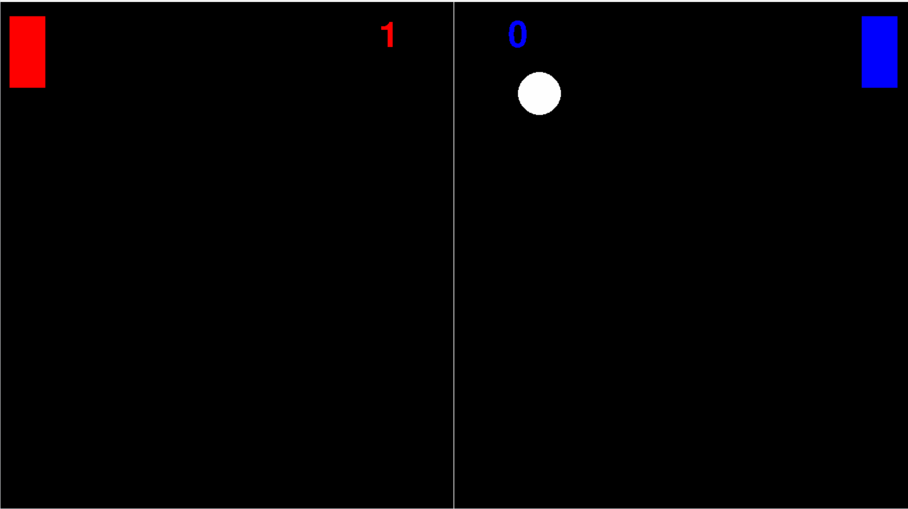

# Arcade 🎮

Welcome to my Arcade repo!
This is a collection of small game projects I've been working on over time, both to learn, test ideas and build better programming fluency.

The style here is a bit "learning by doing": practical, experimental and focused on getting things working, but also with a more structured project style over time.

## Projects

- Chess
- Crabjumper
- PixelRunner
- PlatformGame
- Pong
- Snake

## GIF-previews

### Crabjumper

### PlatformGame

### Chess

### PixelRunner

### Pong

### Snake (norrlandsguld edition)

